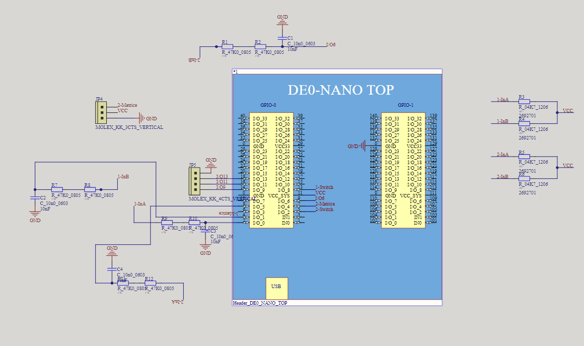
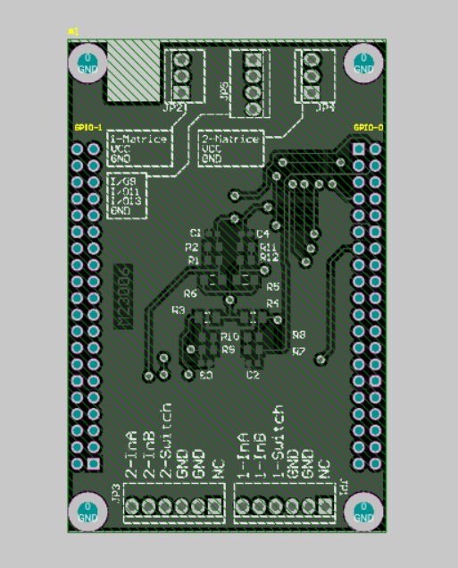
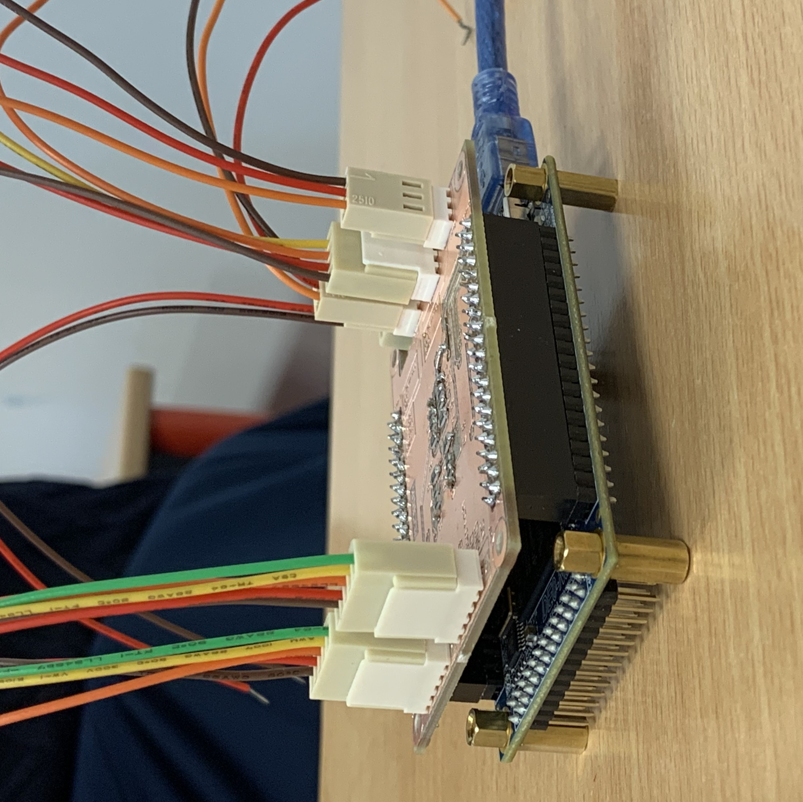

# Connect4 FPGA PCB CAO

This repository houses the design and implementation files for a Connect 4 game developed on a Field-Programmable Gate Array (FPGA), inclusive of Printed Circuit Board (PCB) design and Computer-Aided Design (CAD) files.

## Overview

The project employs VHDL for FPGA development, integrating digital design principles into the classic board game. It includes Quartus project files, media, and Altium Designer files for the PCB, along with SolidWorks part files.

## Repository Structure

- **/Quartus**: Contains Quartus II project files.
- **/media**: Media files including images and videos showcasing the project.
- **AltiumDesigner.zip**: PCB design files in Altium Designer format.
- **Puissance4HocineInès.SLDPRT**: Includes all SLDPRT files for 3D modeling of components.

## Gallery

 

### Video Demonstration

For a detailed video demonstration of the game in action, see the video:

https://github.com/HocineBoudieb/Connect4-FPGA-PCB-CAO/assets/36864416/2671d108-82bc-407a-ac71-dce34e6fa8cb

## Hardware Requirements

- FPGA development board (specific model not specified)
- Standard hardware for PCB manufacturing based on the provided Altium files
- SolidWorks compatible hardware for 3D modeling

## Software Requirements

- Quartus II for FPGA programming
- Altium Designer for PCB viewing and manufacturing
- SolidWorks for viewing and editing part files

## Setup and Installation

1. Clone the repository to your local machine.
2. Open the Quartus project for FPGA programming.
3. Refer to the Altium and SolidWorks files for PCB and part production.

